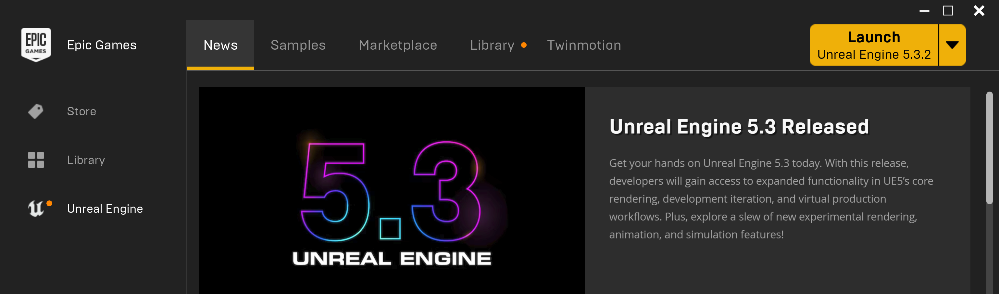
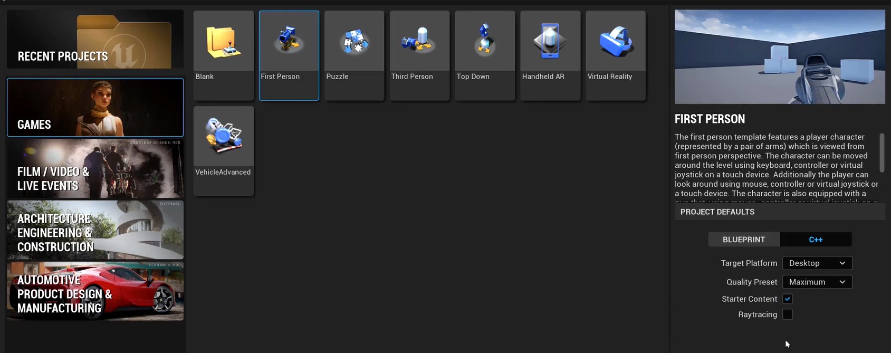

# Project Setup
## Rider IDE

---
If you are using Rider as your IDE but have yet to set it up, [follow the documentation found here](https://www.jetbrains.com/help/rider/Unreal_Engine__Before_You_Start.html#rider_unreal_editor). You can make the needed editor changes after we create our project.

## Launch the Engine

---

Open the Epic Games Launcher, and choose the Unreal Engine option on the left-hand side. You should already have installed the engine. If not, go to the Library tab at the top and install.

With the engine installed, you can click on the launch button to start the engine.

## Create the Unreal Project

---

* Create a new project based on the Games > First Person template.
* For the Project Defaults, choose:
  * C++
    * This isn't absolutely necessary, since we can always enable C++ by just creating a C++ class in a project, but if you don't, some of the files that we want to add custom code to will be created as blueprints instead of cpp files. By choosing C++, it saves us some extra work later on.
  * Target Platform: Desktop
  * Quality Preset: Maximum
  * Starter Content: Checked
  * Raytracing: Unchecked
* Name your project
  * Note that you can name your project whatever you want, but it does affect the names of files that are automatically created for us.
    * Whenever this comes into play, it will be denoted as *YourProjectName*WhateverFile. An example would be *YourProjectName*GameMode.cpp
* Note where your project is being saved. By default this is in the Documents folder.
* Click the Create button.

---
>Next: [Rider Association and Plug-ins](/02_Rider/RIDER.md)
