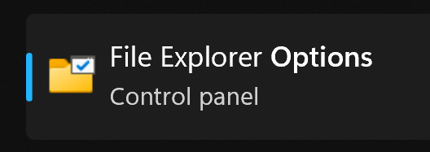
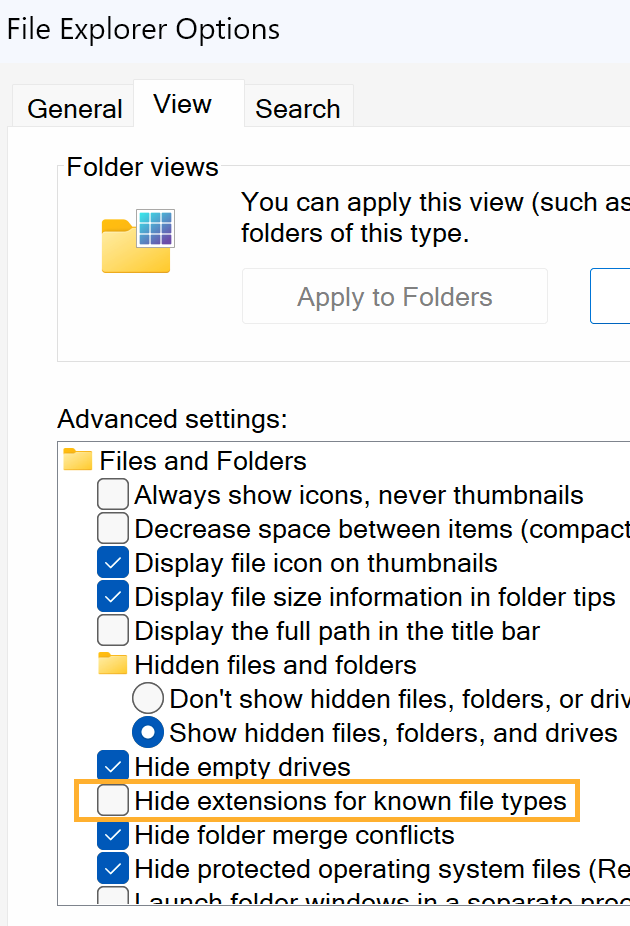
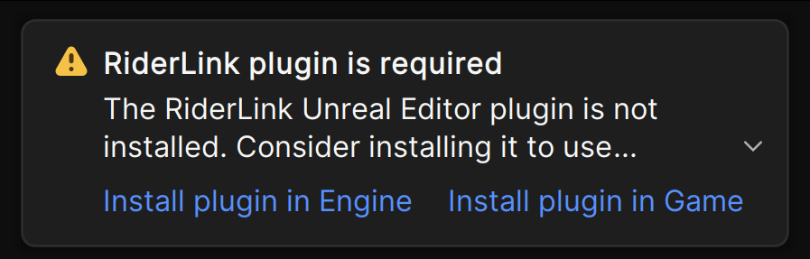
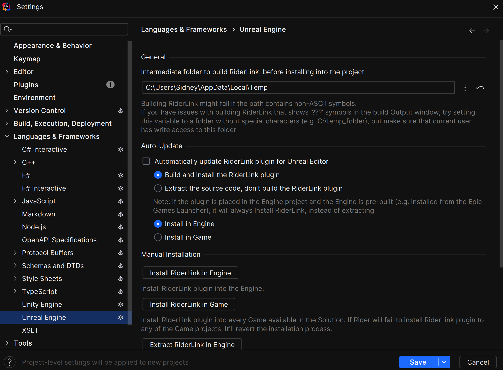

# Rider Association and Plug-ins
## Viewing File Types
So this is possibly just a pet peeve of mine, but I believe it's extremely important to see file types listed when viewing them in a folder. By default, Windows disables this.
To fix this:
* Search for "folder options" in the start / search bar
  * You should see **File Explorer Options** as a result. Select it.
  

* In the new window, click on the tab named View
* In Advanced Settings, find option **Hide Extensions For Known File Types**
  * Uncheck it
  

* Apply and close.

  
## Rider IDE
Each time you open a new project with Rider you will be prompted with a window asking if you trust the project you're opening. For our projects, say yes.

The first time you open an Unreal Engine project, you'll see a notification that the **RiderLink** plugin is missing. 

If you skip this pop-up message, you can install the plugin later on in the Languages & Frameworks | Unreal Engine page in Rider's settings.

## Rider .sln File Association
If you've previously installed another IDE, such as Visual Studio or VS Code, they will be the default program that opens C# .sln files.

A way that we can change that to Rider is:
* Navigate to where you saved your Unreal project.
* If you've made it so you can see file types like you should have, you should see a .uproject and .sln file with your project name.

* Right-click on the .sln file, and choose **Properties** from the context menu.
* In the properties window, you should see **Opens With:**, click **Change**
  

* Choose Rider from the list of applications. If you don't see it listed, you may need to scroll to the bottom and select **Choose an app on your PC** and navigate to where Rider is installed.

If you have issues changing the .sln file association, [refer to this guide](https://www.howtogeek.com/746203/how-to-set-your-default-apps-on-windows-11/) for additional help.

## Rider Hot Tips for Unreal

Hover for definitions
Ctrl+click to find source

---
>Next: [Player Projectiles](/03_Projectiles/PROJECTILES.md)
