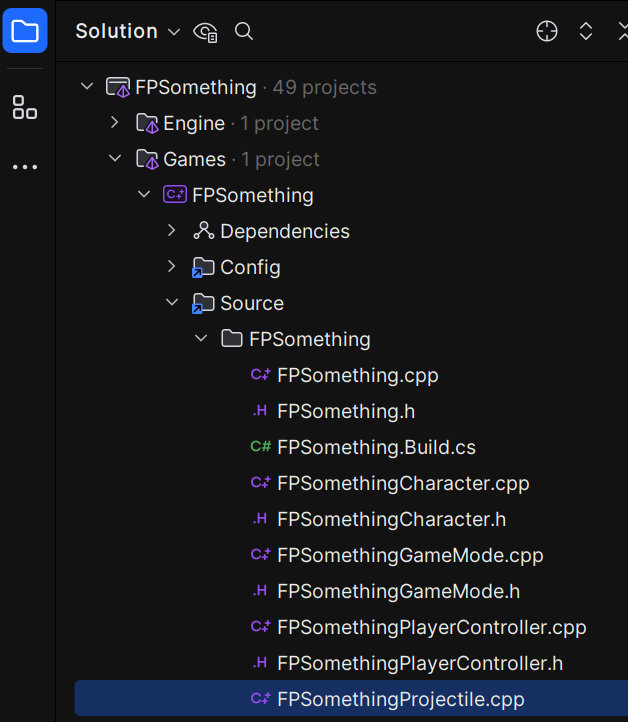

# Projectiles, Collision, and Debugging
To start things off we're going to look at the code that deals with the default projectiles in the First Person template.

To access it, you can open the file from the Unreal Engine or open the .sln file for your project.

>[!TIP]
>The file that you're looking for is named *YourProjectName*Projectiles.cpp.

I'm going to be opening this file after opening my .sln file. Once Rider is open, you should see your project laid out on the left side like this:

>You'll find the file in: *YourProjectName* Folder > Games >  *YourProjectName* > Source > *YourProjectName* > *YourProjectName*Projectiles.cpp 

## *YourProjectName*Projectiles.cpp 

In this file, we want to look at the **OnHit** function:

Let's start off by analyzing the arguments taken in by the function:
* UPrimitiveComponent* HitComp
  * This is the primitive component hit by the projectile
* AActor* OtherActor
  * The actor that was hit
* UPrimitiveComponent* OtherComp,
  * The component of the other actor
* FVector NormalImpulse
  * The direction of the hit
* Const FHitResult& Hit
  * Provides information about the hit such as location

If we look inside the function, we'll see that the first thing to happen is that we check for null pointers.

Since the arguments are being passed by pointer, there's a chance that the pointer could be null.
Remember when you pass by reference, you can not pass null. The thing being referenced must exist. This is why we typically pass by reference when feasible.

The exception to that is when you start working with dynamic data structures. In that case you'd pass by pointer.
This is the typical approach when working on large projects with many moving parts that may or not exist at any given time, such as a game.

The downside to this approach is that we must check for null.

If we look at our if conditions, we can see that we are checking:
* if the actor hit is not null
* and the actor is not the projectile (this)
* and the component of the actor hit is not null
* and the component is simulating physics

If all this passes, then we add impulse onto the actor hit through its UPrimitiveComponent by:

If you play the example template as is, you'll see that this is what imparts the physics onto the blue cubes in the scene when hit by a projectile.

Understandably when you first come to Unreal's C++, this can be a lot to take in, and leave you wondering where all this comes from. Even with an understanding of C++, we need to learn Unreal's special take on it. Keep in mind that their implementations ultimately make the process of making anything with the engine much easier.

One of the most helpful tools when learning any coding language, which is basically what we're doing here, is to log messages so that we can test and understand what's going on.
Here is two ways that we can do that in Unreal. [Check their API page](https://dev.epicgames.com/documentation/en-us/unreal-engine/logging-in-unreal-engine) for more information on other methods and an explanation on their arguments.

The first is **UE_LOG**. After the first bracket in the if statement, add:

This will print the name of the actor hit by a projectile to Unreal's console.

The other method, and possibly easier to read, is **AddOnScreenDebugMessage**. This will print a debug message inside your view window while playing the game. To use this function, you have to have access to the engine library. This should typically be included in an Unreal project, but that's not always the case. Because of this, you'll often see it paired with an if statement to make sure the library is available.
Below your UE_LOG code, add:

Know when you play the game and shoot one of the blue cubes, you'll see its name printed onto the screen.

---
>Next: [Creating an Enemy Class](/04_EnemyClass/ENEMYCLASS.md)
