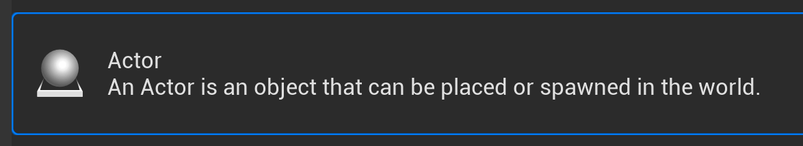
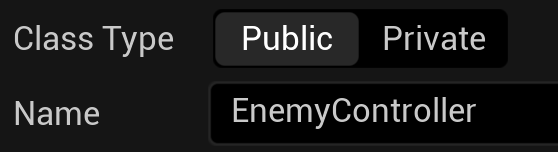
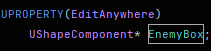
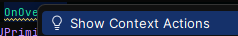
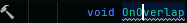
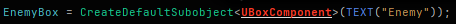
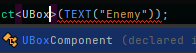
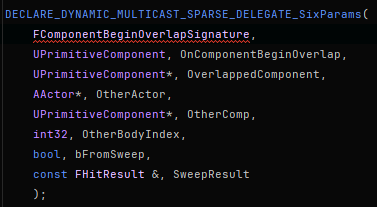
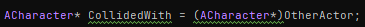
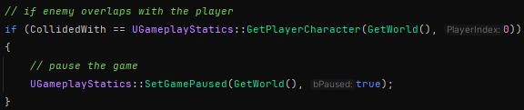

# An Enemy Class
After looking into the provided projectile class, I'm sure you're still unsure how things are working in Unreal.

To help us understand a bit more, let's create our own C++ class.

>[!TIP]
> When creating a new C++ class, always do it through the engine. This is the easiest way to make sure everything works properly, such as Unreal's Reflection system that we'll discuss more later.

## Unreal Enging - Creating a C++ Class

Our class will be for spawning enemies into the world. To create it, you can either goto Tools > New C++ Class...

or, in the content drawer, inside of your C++ Classes folder, right-click. You should see the context action to create a new C++ class. 

You'll then choose Actor as the parent class.

Then we can leave it as Public. I named my class EnemyController because this will handle and control all of our enemies properties. Note that I will also refer to this file as such throughout the documentation, so if you named yours differently, keep that in mind.

Click on the Create Class button. Afterwards, both the header (.h) and the cpp file for the class should open in Rider.

Looking at the project hierarchy, you'll notice that a Public and Private folders have been added.

You'll find your header files in the Public folder and your cpp files in the Private folder for newly created classes.
Let's start off by looking at the generated code of our header file.

## EnemyController.h

* #pragma once
  * Our friendly header guard
* #include "CoreMinimal.h"
  * Provides access to a set of ubiquitous types (including FString, FName, TArray, etc.) from UE's Core programming environment.
* #include "GameFramework/Actor.h"
  * This is Unreal's actor class that we are inheriting from
* #include "EnemyController.generated.h"
  * This is a special header generated by the engine. In truth, it's more of a marker for the Unreal Header Tool that tells it that our class contains reflected types.

>[!WARNING]
> Every *ClassName*.generated.h must always be last in your list of includes in order to be picked up by the Unreal Header Tool. Things will not work as expected otherwise.

## A quick aside on Unreal's Reflection system:
From: https://www.unrealengine.com/en-US/blog/unreal-property-system-reflection

> Reflection is the ability of a program to examine itself at runtime. This is hugely useful and is a foundational technology of the Unreal engine, powering many systems such as detail panels in the editor, serialization, garbage collection, network replication, and Blueprint/C++ communication. This is required in order for your class to be considered by the Unreal Header Tool during compile.

> By including the generated.h file, we can now use the Unreal's macros UENUM(), UCLASS(), USTRUCT(), UFUNCTION(), and UPROPERTY() to annotate different types and member variables in the header. Each of these macros goes before the type or member declaration, and can contain additional specifier keywords.

A key takeaway from this is that Unreal's Refelction system adds garbage collection to the C++ language, which is hugely useful, but in order for that to happen, we need to preface items with macros defined in the engine.

Here is a list of macros that we'll need to know for now:
* UCLASS()
  * The base class for objects in Unreal is UObject. You can use the UCLASS macro to tag classes derived from UObject so that the UObject handling system is aware of them.
* UFUNCTION() 
  * Used for any function that you want to make available to the engine.
* UPROPERTY()
  * These tend to be variables.

When specifying macros, you can add keywords so that you can edit and display them within the Unreal Editor.

## EnemyController.h - Continued
Before our class, you'll see the UCLASS() macro automatically added. Then you'll see something like:

After class, you'll see *YourProjectName*_API. This is a macro defined by the Unreal Build Tool, and on Windows, they handle DLL import and export declarations. These are created by default and most likely not needed unless you're making a plugin for the editor or engine.

Within in the class declaration, you'll also see **: public Actor**. This just means that our class is inheriting from Unreal's Actor class.

Then next line in a class should always be the GENERATED_BODY() macro. This is a macro used by the Unreal Header Tool that will paste generated code in its place. This is required for UObjects to correctly function, and must always be at the top of the class.

Next we'll see our class access modifiers. Remember that by default everything within a class is Private, which means it's only accessible within the class. Public means that it's accessible outside of the class. Protected is the same as private, but also allows sub-classes of the class ( or classes that inherit from the class ) to also have access to the member.

Below we see our default class constructor in public. Then we see BeginPlay() and Tick. Both are listed as virtual functions. 

This means that they are declared in our parent class. This also means that we can override these functions, which allows each child of the Actor class to have its own separate actions that happen when these functions are called.

### Let's Add Some Stuff

Below our class constructor, let's add:

We added the UPROPERTY() macro so that it's managed by the reflection system, but also notice within the macro, we added a keyword. EditAnywhere means that we can also edit this inside of Unreal. We'll see this later on.

>[!NOTE]
>Also note that the macro is typically placed inline, like this:
>
>
>
>The spaced / tabbed version is my personal preference. I feel it's easier to read, but both are valid.

We then create a property name EnemyCube based on the UShapeComponent class. If you hover your mouse over the class name in Rider, you'll see the definition for the class:

Below our EnemyBox, lets add the following function:

You'll notice that the function's name is underlined in yellow. This means that the function has yet to be implemented in the cpp file. Personally, I like having Rider do this for me.
Two ways to do this are to right-click the function name, then from the context menu choose Show Context Actions

Then choose Generate Definition

>[!NOTE]
>Another way is to left-click on the function name. After doing so, you should see a hammer icon by the line number if of the function. Clicking that hammer icon will bring up the same context menu where you can choose Generate Definition.
>
>

This should automatically open your cpp file with the generated definition. You may notice that the arguments taken in by our function are similar to those in the Projectile's OnHit function. To find out how I knew how to construct the function, let's continue in the cpp file.

## EnemyController.cpp
In our cpp file, the first thing should always be to include our related header file. 

>[!WARNING]
>You may or may not notice that it looks like this in Rider:
>
>
>
>This may mean that you need to build and reload the project or refresh your solution file. Other times I've solved the issue by quitting and reopening Rider.
>
> Do Not Follow the context suggestion to use the full path to the header file.
>This is unnecessary and bad practice. Fix it through one of the previous mentioned solutions.

Below that you should also see the definitions for our class constructor, BeginPlay, Tick, and our OnOverlap functions. To better understand our OnOverlap function, let's make it so that we actually use it.
In our class constructor and below PrimaryActorTick, let's setup our EnemyBox component:

You may notice that our type of UBoxComponent is red. This is because we're missing the needed header files to use that class.

>{!IMPORTANT]
>If you allow Rider's Intellisense system to complete what you're typing, Rider will often automatically include the needed headers. This is both good and bad. Bad mainly if you click on the wrong option and include unneeded headers. You will want to delete any headers included this way.

Otherwise you can right-click and follow the context options to have the needed headers added.

Now let's add the following:

### What Did We Just Do?
EnemyBox = CreateDefaultSubobject<UBoxComponent>(TEXT("Enemy"));
* Creates a sub-object of the specified type
* Our chosen type is UBoxComponent. UBoxComponent is a simple box typically used for simple collision.
* TEXT("Enemy") names the sub-object to Enemy

So we've essentially added a sub-object to EnemyBox of the UBoxComponent class with the name of Enemy.

To understand the following lines, we can [refer to the UPrimitiveComponent class in the API](https://dev.epicgames.com/documentation/en-us/unreal-engine/API/Runtime/Engine/Components/UPrimitiveComponent?application_version=5.3).

We're looking here because we created EnemyBox from the class UShapeComponent, which inherits from the class UPrimitiveComponent.
Also remember that EnemyBox is a pointer, so we access members through the pointer member access operator (->).

SetGenerateOverlapEvents(true) turns on overlapping events for EnemyBox. This allows us to use the next function.
OnComponentBeginOverlap will trigger when our enemy first overlaps with something else.

If we hover over AddDynamic, we can actually see that it's a helper macro

For arguments it requires the user object to bind to, which we want to bind it to EnemyBox (this) and the function to call. For the function, we give it reference to our OnOverlap function.

Okay we're using the function, but we still don't know why our OnOverlap function takes the arguments that it does.

### Let's Dig In
Click within the function name of OnComponentBeginOverlap. Hold down ctrl and OnComponentBeginOverlap should become a clickable link.
After we click on it, PrimitiveComponent.h will open and we can see the UPROPERTY of OnComponentBeginOverlap is of type FComponentBeginOverlapSignature

Let's dig deeper by ctrl clicking on FComponentBeginOverlapSignature. We're still inside PrimitiveComponent.h, but we're taken to the delegate declaration of FComponentBeginOverlapSignature, as well as other delegates.

Delegates can simply be thought of as pointers to functions. FComponentBeginOverlapSignature uses DECLARE_DYNAMIC_MULTICAST_SPARSE_DELEGATE_SixParams. 

We'll dig into creating our own delegates later. For now we can use this to understand that if we want to use OnComponentBeginOverlap, which is of type FComponentBeginOverlapSignature, we need to provide six parameters.

Delegates are created a little different than a function, but if we change the way we look at the delegate and understand that the first parameter is the name, we can look at it like this:

Now we can see the types and names of all needed parameters for the delegate. This is what we use when defining our arguments for the OnOverlap function.

### Back to Our OnOverlap Function
We have a function that will trigger when it begins overlapping with an object. What we want to do is check if the thing that it's overlapping is the player.

To do this we want to check the character component of the player. First in our OnOverlap function, let's add:

We create a variable with the name CollidedWith that's of the class character. Since the thing that was collided with ( OtherActor ) comes in as an Actor, we need to cast is to a Character. Here we're using a C-style cast to do that.

Next we'll add an if statement to check if it was the player that we collided with:

We get reference to the player character through the use of the UGameplayStatics class. Within it is the function GetPlayerCharacter, which takes the arguments of the map you want to search and the player index. We want to search the current level, so we use GetWorld() to grab reference to that. Since our game only has one player, the index needed is 0.

Now if an enemy hits a player, there's typically a consequence. For now, let's pause the game if the enemy touches the player:

## Rider - Build and Reload

Now we want to build and reload our project. You should hopefully get a success message from the Live Coding window. If not, review the window for errors and fix them.

If it's good, head back into the engine to add our enemy to the game.

## Unreal Engine - Adding Our Enemy
In your Content Drawer | C++ Classes folder, you should see a folder named Public. Inside you should see the EnemyController C++ class

Drag and drop that into the level.

It should look like a wireframe cube. Move it up so that it sits on the ground.

With the enemy controller selected, in the details tab click on teh Add button. Then select Cube. You can leave it named Cube.

To make it more of an "enemy", I'm going to change the Cube's material to something more menacing like the M_Metal_Rust material.

If you play the game in this state, you'll notice that nothing is really happening with our enemy. We had it set to pause the game if it overlaps with the player, but you can run into it and nothing happens. Is it broke?

No. We need to make another change.

Select the cube we added in the EnemyController and find its collision properties. Within you should see Collision Presets. Change this to NoCollision.

This allows our OnOverlap function to handle what happens.

## Unreal Engine - Save and Play

You should now be able to run into the enemy and the game will pause. Except we didn't make a way to unpause it, so you'll need to press ESC to stop playing the game.

---
>Prev: [Player Projectiles](/03_Projectiles/PROJECTILES.md) | Next: [Spawning Enemies](/05_GameMode/GAMEMODE.md)
