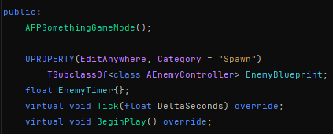
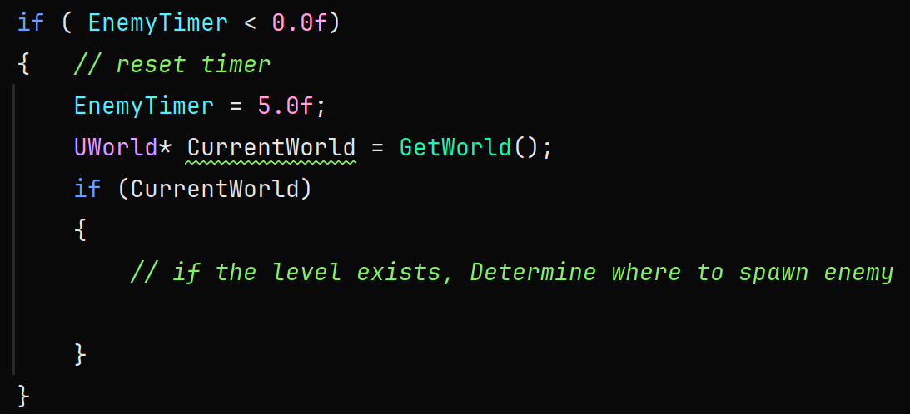
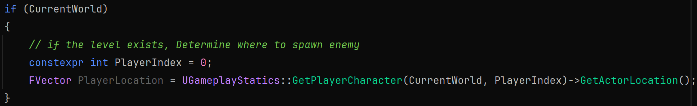
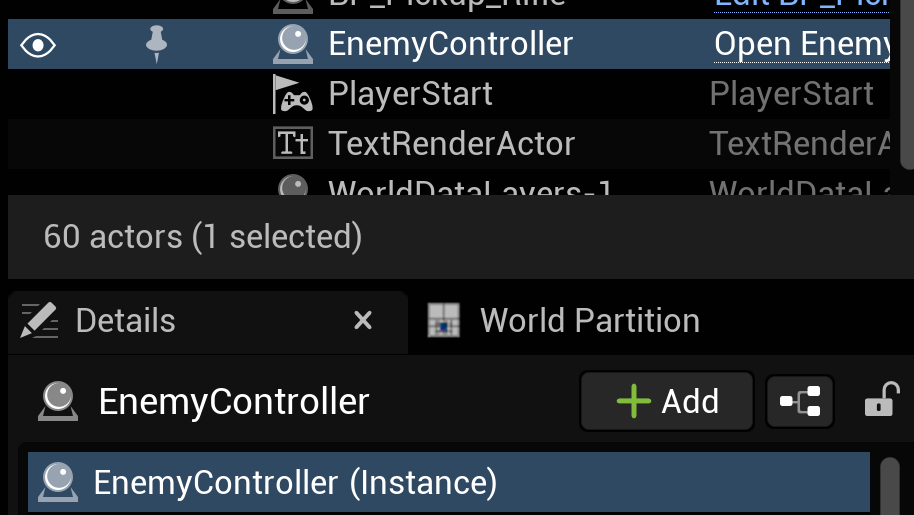
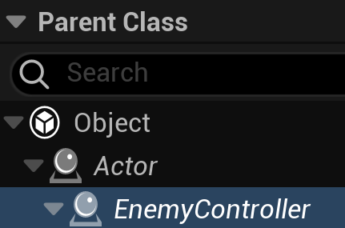

# Game Mode
Typically GameMode is used to set the rules for the type of desired play. We're going to use it so that we can randomly spawn enemies on our map.

If we created our project as a blueprint project, our game mode would be a blueprint. Since we created the project as a C++ one, you should see the header and cpp file in Rider as *YourProjectName*GameMode.
Open both the header and cpp file. We'll start in the header.

### GameMode.h
You'll notice that GameMode is pretty sparse. Let's add some functionality by adding the following below the default constructor:

Generate the definitions for the functions.

### GameMode.cpp
The first thing we want to do in the cpp file is add the following to the constructor:

This allows to use the Tick() function. Otherwise, it won't be called.

Let's add some functionality to the Tick() function.
Whenever we're making a call to the parent's function, that call must be the first thing to happen in the function.
Then since we plan on spawning enemies at a constant interval, we need to subtract our delta from our timer. Then let's check if our timer is less than 0 with an if statement.
If it is, let's set it back to our desired spawn interval.

At the moment all we've done is have EnemyTimer countdown from 5 to 0 for infinity. Now we want add in the ability to spawn our enemy when the timer reaches 0. Let's not stop there. Let's also have the enemy spawn near wherever the player currently is on the map.
In order to do that, we need to know where the player currently is. To make that easier, in the UGameplayStatics class there is a GetPlayerLocation function that we can use. To use it we need to pass in a couple of arguments, the level we want to search and the index of the player.

The level we want to search is the current one. We'll create a reference to that using the GetWorld() function. Then we need to make sure that it's not null.

Now we can create a variable for the player's index for illustration purposes. In a single player game, the index you want will always be 0.

Then will create an FVector variable to store the PlayerLocation. FVector stores the x,y,z value for world coordinates.
UGameplayStatics::GetPlayerCharacter(CurrentWorld, PlayerIndex) grabs ref to the character at index.
GetActorLocation() gets that character's location.

Then let's create and set EnemyLocation to be PlayerLocation by

Having the enemy spawn right on top of the player, won't be much fun for the player, so let's offset the enemy location by a random amount each time.
We'll do that by generating a random value and adding that to the x and y of EnemyLocation

We've yet to spawn our enemy, but we can do that through the SpawnActor function with reference to our level. The arguments needed look like this: SpawnActor<Type>(Visual, Location, Rotation)
We'll start by creating an instance of our enemy class and setting it equal to our CurrentWorld SpawnActor function.

FRotator is a struct that holds rotation info and ZeroRotator sets each axis to zero degrees rotation.

Build and reload. Then we'll head to Unreal.

### Unreal Editor

In the Content Drawer and in the All > Content folder, create a new folder named BluePrints. This is where we'll save any blueprints that we make for the game.

Now select the EnemyController that currently exists in the level and view the details tab on the right.

Make sure that EnemyController (Instance) is highlighted and then click the blueprint button that's beside the Add button.

For the parent class, EnemyController should be selected

Name the blueprint BP_Enemy and make sure the path it's being saved to is the blueprint folder that we created earlier. The blueprint editor should open. You can just save it and then close it.

Now we need to make a blueprint for our GameMode. Inside the BluePrints folder, click on the Add button or right-click inside the folder and choose to create a new Blueprint class

For the parent class, you want to go down to the bottom at All Classes and search for "gamemode". You should see the name of the game mode that we were working on called *YourProjectName*GameMode. Select it.

I named my file BP_FPGameMode.

* Open the blueprint
* In the Details pane, you should see the spawn category we made
  * You should also see the Enemy BP option
  * Set our BP_Enemy as the BP to spawn
* Also change the Player Controller Class to the included BP_FirstPersonPlayerController
* Compile & save

Finally, we need to tell Unreal that we want to use our GameMode when we play the level.

Click on the settings button in the top-right of the editor and then choose world settings

This will open another tab where the Details tab lives. You can search for gamemode. We're looking for the option **GameMode Override**. Then we want to choose the blueprint that we made for our GameMode:

You can also delete the EnemyController in the level if you like, since they will now spawn in through our GameMode. Save the project and try playing it.

You should now be able to walk around, while enemies spawn in your proximity. If you feel the enemies spawn too close or too far, you can adjust the RandomDist min and max values. You could even make those values into UPROPERTY variables where you can change them in the editor if you wanted.