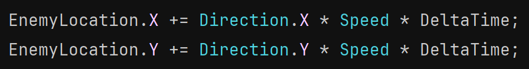

# Enemy AI
At the moment our enemies are pretty boring. It would be more exciting if they actually moved towards the player after they spawn.

To start off let's head back to our EnemyController.h

### EnemyController.h

In the public section of our class we want to add a couple of variables.

Direction is an FVector that will hold the direction the enemy should head.
Speed will be the rate that our enemy travels. By making it a UPROPERTY with the EditAnywhere tag, we can change the value in the Unreal editor if we want.

### *YourProjectName*GameMode.cpp
Now we're going to head back to our game mode where we were spawning our enemy inside of Tick().
After we spawn an enemy, we want to sets its direction to be pointed at the player. So what we want to get is a vector, think of an arrow, pointing torwards the player from the enemy object.
To do that we'll get the difference from where the enemy is at and where the player is. In order to turn the difference in location into a direction, we can use the function GetSafeNormal().

Since we added the variable Direction, we can store the direction we want the enemy to go like this:

With the direction set, we can go to EnemyController.cpp

### EnemyController.cpp
In the EnemyController Tick() function, we want to start off by getting our enemy's location.

A reminder on axis directions: x = left & right, y = forward & back, z = up & down.
To make the enemy head in the direction of the player we can do this:

We also want to update this by the speed we want the enemy to move
Also to make sure that it looks the same and isn't dependent on fps, we multiply by DeltaTime
Multiply by delta time whenever you work with movement in a game

Finally we need apply the updated position to the enemy by

Now you can build and reload, head back to Unreal, and play the game. You should now see enemies spawn in and start moving in your direction. You'll notice that they stay moving in the direction they were initially spawned with.