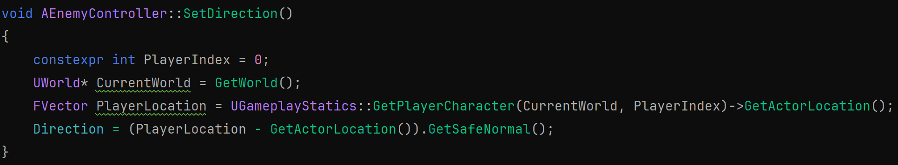
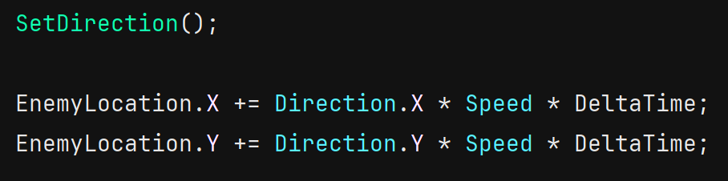

# Enemy AI - More
Right now our enemies are more annoying than challenging. Instead of just moving towards us, what if they chased the player?

The good news is, we've already written the code to accomplish this. We just need to put it in a different spot.

Currently we tell the enemy which direction to go based on the player's current location, but we only do that when we spawn in the enemy. 

Let's take that same logic and update it as long as the enemy is alove.

### EnemyController.h

In the public section of our class, add the function SetDirection. Have Rider generate the definition, and move to the cpp file.

### EnemyController.cpp
In SetDirection, we'll use the same logic as we did when we spawned the enemy in our GameMode. Note the only difference is that we don't need to get our Enemy because, in this file, we are the enemy.

Now we can go into the Tick function. We just need to call SetDirection before we update the enemy location.

Build and reload the project. When you play the game, now the enemies should chase the player around the level.