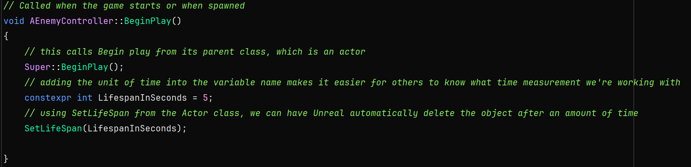

# Enemy Lifespan
Currently in our game, if the player were to never get hit, the game would spawn enemies for as long as it could.
I don't say infinitely because each time an enemy is spawned, a chunk of memory is taken from the computer. Eventually the computer would run out of available memory and crash. This is called a memory leak.

If you remember from the section about Unreal's reflection system, Unreal has built-in garbage collection that should free up memory for us. But since we never destroy an enemy, garbage collection never occurs.

Built into the Actor class, which our EnemyController inherited from, there is a function that we can set to automatically destroy an actor after a specified amount of time.

### EnemyController.cpp
Let's go to the BeginPlay function and add the following:

Now if the player is able to avoid the enemy for 5 seconds, the enemy will automatically be removed from the level. Adjust this time to your liking.

This is one quick way to deal with the situation. Know that destroying and spawning actors does use up resources when doing so. 
Another way we could handle this would be to move the enemy to a new location rather than spawning a new one.
Let's say that if we wanted 10 enemies max on the screen at one time, rather than destroying and spawning we would just move the instance that would be destroyed to a new location. This would essentially be like we were spawning it again.