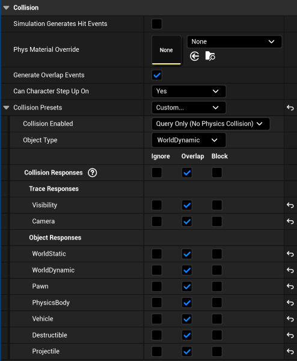

# Managing Enemy Collisions
We're removing enemies based on a time limit, but let's put a little more power into the hands of the player. Let's make it so the player can shoot the enemy to destroy them.

## EnemyController.cpp
Let's go to our OnOverlap function.

As is, we're checking to see if the actor that the enemy has collided with is the player. Let's also check to see if it's a projectile. We can do that by adding an else-if statement onto the existing if statement.

For our condition, we get the name of the actor collided with and see if it contains the string "Projectile".

If it does, we first destroy our enemy object. Then we also destroy the OtherActor, which is a projectile in this case. 
We do this so that one projectile doesn't destroy multiple enemies. Of course, if you wanted this to be part of a mechanic or special ammo type, you could choose not to destroy the projectile.

## Rider - Build and Reload
Code-wise, that was pretty easy, but we still need to manage collision settings inside of the engine.

## Unreal Engine - BP_Enemy
Open BP_Enemy. Select the EnemyBox component on the left-hand side. Then on the right-hand side, search for collision.
Inside, Generate Overlap Events should be ticked, and we want to change the Collision Preset to Custom. Click the arrow beside Collision Preset, and you'll see a list of how our enemy is set to manage collisions with each item listed.
At the bottom, you should see Projectile. We want to tick the Overlap option. 

Remember that we wrote our code to happen OnOverlap, so we need the collision between our enemy and projectile to be handled the same way.
If you were to look at the projectile collisions in the projectile blueprint, you'd see that they are ticked to block everything. That's fine. If one actor is set to overlap, the collision system will default to that.

## Unreal Engine - Compile, Save, and Play
Compile and Save. When you play the game, now you should be able to pick up the gun and shoot the enemies to make them disappear.

---
>Prev: [Enemy Lifespan](/08_Enemy_Lifespan/LIFESPAN.md) |  Next: [A Simple Scoring System](/10_Score/SCORE.md)
