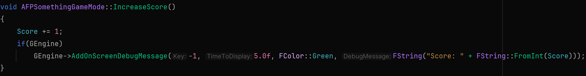
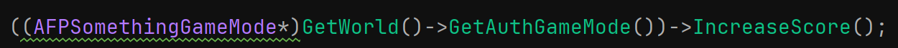

# Player Score
Typically games have some kind of goal for the player to achieve. The most classic one is achieving a high score.

### *YourProjectName*GameMode.h
In the protected section of our GameMode, let's create a variable that keeps track of the player's score.

In the public section, let's create a function that allows us to increase the player's score. Then generate the definition for the function and move to the cpp file.

### *YourProjectName*GameMode.cpp
Our IncreaseScore function is pretty simple. Each time we call it, we just want to add one to the player's score. If you wanted to created a more advanced scoring system, you could pass an argument into the function with the value to add to Score.
Let's also add a debug message so that we can tell if it's working or not.

### EnemyController.cpp
Now we want to call our IncreaseScore function when an enemy has been destroyed by the payer. We added the logic to do that through the else-if statement, so we can go there and also call the IncreaseScore function.
To do this, we need to get a reference to the current game mode being used in the level. We also need to cast this to our custom game mode so that we will have access to our IncreaseScore function. That looks like this:

Why do we need to do this? GetWorld()->GetAuthGameMode() will return a type of AGameModeBase. This is why we need to cast it to be a type of our GameMode. This is all contained in () and becomes a reference to our GameMode and allows us to call our IncreaseScore function.

Build and reload. When you shoot an enemy, you should see your score increase through the debug message we created.