# Score UI
It doesn't look great outputting our score through debug message, so let's build a simple UI to display that for us.

## Unreal Engine - Create a New C++ Class
In the engine, we want to create a new C++ class. When choosing the parent class, choose the All Classes option at the top. Then search for UserWidget.

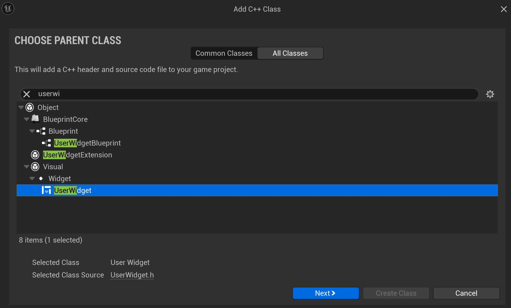

Then I chose to call mine ScoreWidget and created the class.

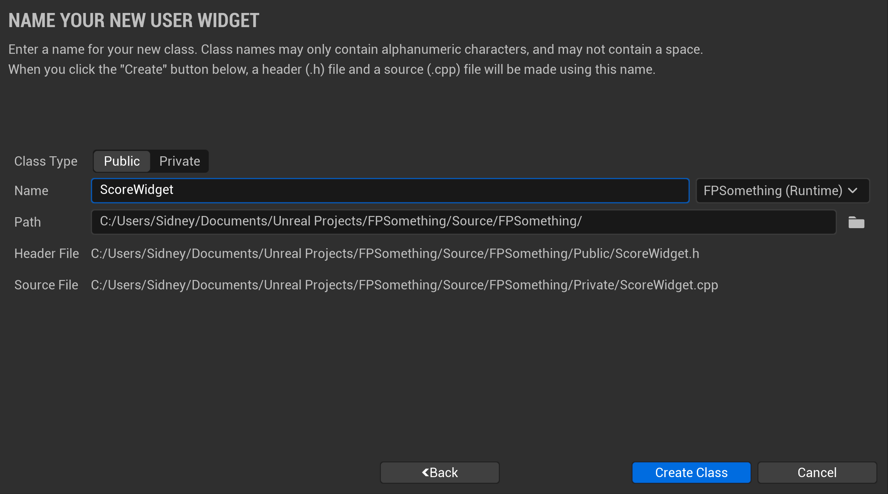

## ScoreWidget.h
Inside our widget class header, we only need to add a few things. We need to make a public section, a variable that will store the text for our widget, and a function to update that text.

Since the function is a single line, we can declare it inline and not in the cpp file.

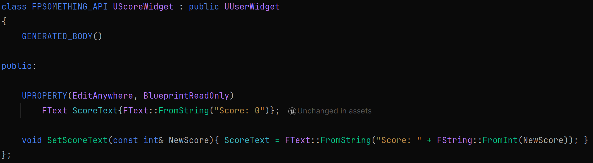

## *YourProjectName*GameMode.h
Inside of our GameMode's protected section, we want to create a reference to the widget class that we want to use so that we can spawn it into the game.
We also want to store the widget when it's created so that we can update its text.

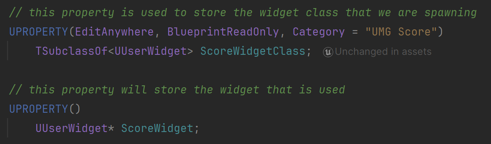

### *YourProjectName*GameMode.cpp
Inside of our GameMode's BeginPlay function, we want to spawn a widget of the select widget class. Then will store that into a variable and add it to the view port.

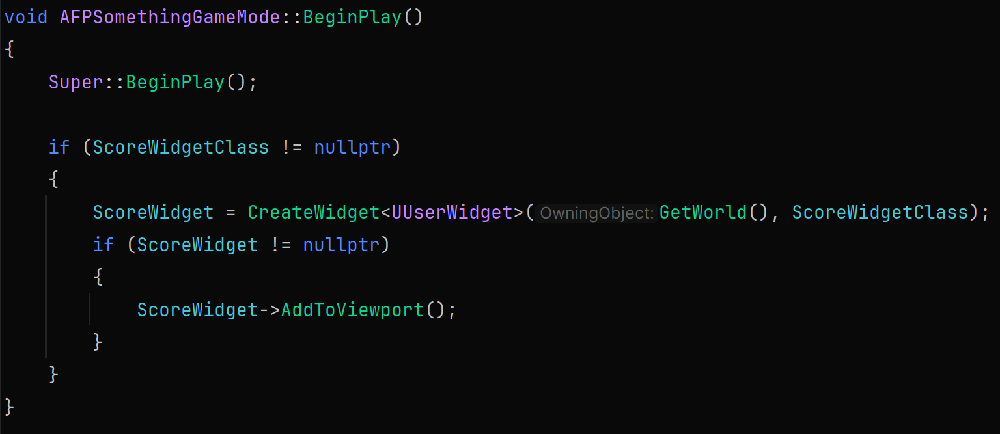

In the IncreaseScore function, we can comment out the debug message that we were using, and add the following line to pass the current value of score to our widget.

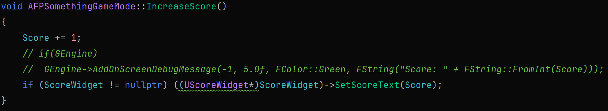

## Rider - Build and Reload
Build and reload. Then we'll head to the engine.

## Unreal Engine - Widget Blueprint
Now we need to create a blueprint based on our widget class.

Create a new blueprint class. For the parent class, goto all classes and search for our ScoreWidget

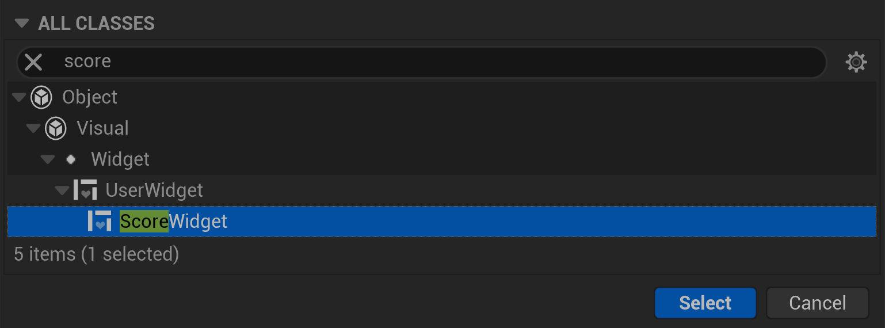

I named min BP_ScoreWidget and then opened it.

Inside, choose the Text option from the left. Then drag and drop it into the workspace.

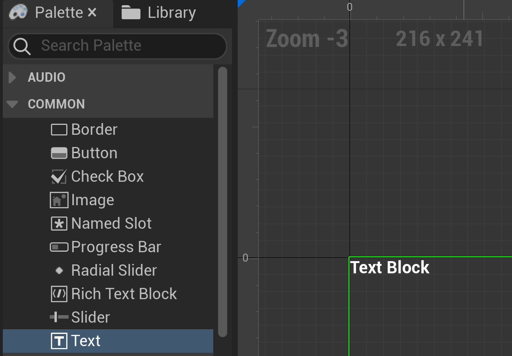

In the Details tab on the right, find the Content > Text option. Click on the Bind dropdown beside it. You should see our ScoreText variable.

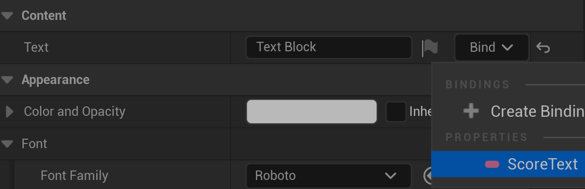

Select it. Compile and Save the widget.

Now we want to open the blueprint for our game mode. You should see the category we made called UMG Score and a dropdown to select a widget class.
In the dropdown, select the blueprint for our score widget.

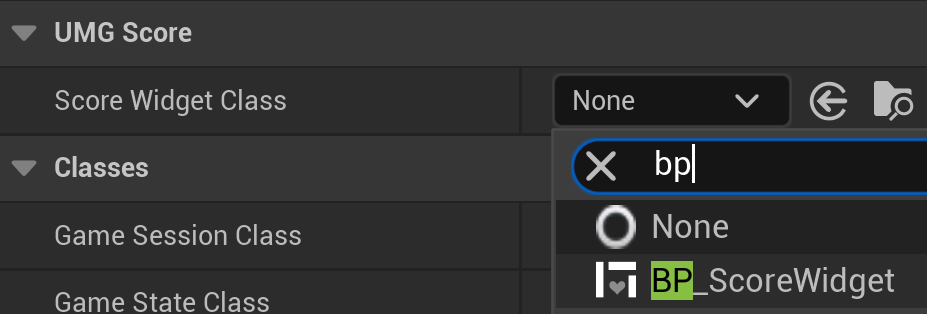

## Unreal Engine - Compile, Save, and Play
Compile and Save the game mode. You should be able to play the game and have the score UI update as enemies are destroyed.

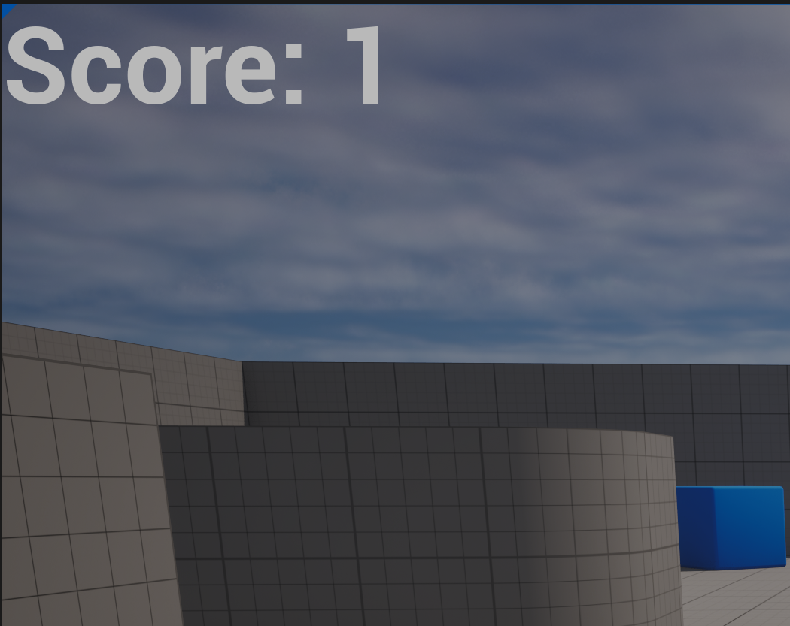

---
>Prev: [A Simple Scoring System](/10_Score/SCORE.md) |  Next: [Additional Game Mechanics](/12_Mechanics/MECHANICS.md)
