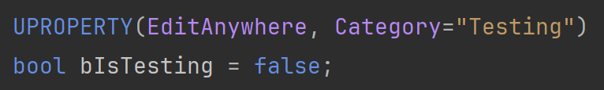
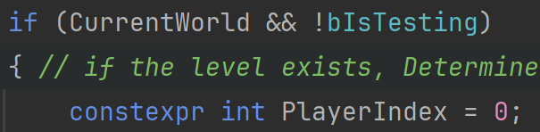
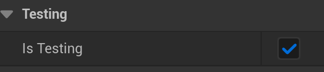

# Additional Game Mechanics
Here we'll look at some additional mechanics that we could add to the game and how to implement them using C++.

Mechanics Covered:
* Make Testing Easier
* [Reloading](https://github.com/sidneychurch/UE5-CPP-Beginner-FPS/blob/main/12_Mechanics/MECHANICS.md#reloading-tp_weaponcomponenth)
* Rocket Jump

## Testing: *YourProjectName*GameMode.h
We want to work on some additional mechanics, but everytime we run the game we have to deal with those pesky enemies. If we're working on game mechanics that don't involve the enemy, we shouldn't have to deal with an unnecessary obstacle when testing.
Depending on the game, this might not be that big of a deal, but for me, every enemy collision pauses the game. Rather than modifying code and changing it back everytime I want to test a feature, let's setup a testing state in our GameMode.

In the public section of your GameMode header, add this:

## Testing: *YourProjectName*GameMode.cpp - Tick()
In the tick function where we're spawning enemies to the game, let's also check if the boolean we just created is false:

Build and reload.

## Testing: Unreal Editor - BP_GameMode
Open the blueprint for your GameMode. You should see a new "Testing" category and checkbox for the boolean.
This is because we set it to "EditAnywhere". Now whenever we don't want enemies to spawn, we can check that box, compile, and save.

Do so, and you should see that's the case. Now we can focus on any mechanics that don't involve enemies.

## Reloading: TP_WeaponComponent.h

To add in a reload mechanic we're going to start off in TP_WeaponComponent.h. If you look through the provided classes, you'll notice inputs are split between weapon and character.
*YourProjectName*Character handles character movement and camera controls, while TP_WeaponComponent applies only if the weapon has been picked up.

Inside the WeaponComponent class, you'll find other examples for mapping inputs to actions. We're going to copy this format and add a ReloadAction:

Let's also add the variables MaxAmmo and CurrentAmmo, as well as a function named Reload. You should see how Reload() mimics Fire().

Have Rider generate the definition for Reload, and we'll move in the the character TP_WeaponComponent cpp file.

## Reloading: TP_WeaponComponent.cpp
In the UTP_WeaponComponent constructor, we're going to set our CurrentAmmo to our MaxAmmo amount.

We can also do the same for our Reload Function:

Now let's go to the Fire function and encapsulate the last three if statements with another if statement. The condition for our if statement makes sure that the firing of a projectile, the firing sound, and the character animation doesn't happen if we're out of ammo. If we do have ammo, we want to remove one everytime the weapon is fired.

Now we want to head down to the AttachWeapon function. This is where inputs relating to the weapon are added to the player character when the player picks up the weapon.
At the bottom, you should see where FireAction is being bound as an input component. We want to copy that and change it to also add in our ReloadAction and Reload function.

## Reloading: Rider - Build and Reload
Build and Reload. Then go to Unreal.

## Reloading: Unreal Engine - Input Mapping
In the Unreal Content Drawer and inside All > Content > FirstPerson > Input, you'll see two IMC files ( Input Mapping Context ). Default is for character movement and camera controls. Weapons is for when the player picks up the weapon. We want to open up IMC_Weapons.

Inside we want to add a new mapping by click on the '+' icon.

Then choose to create a new Input Action. For consistency, place it in FirstPerson > Input > Actions, and save it as IA_Reload.

Head to that folder and open IA_Reload. Under Action, you should see Triggers. Click the '+' button to add one array element. Set that element to Pressed. Then save IA_Reload.

Back in IMC_Weapons, click the arrow beside our new IA_Reload mapping, and map it to the 'R' key on the keyboard. Save IMC_Weapons.

Now let's head into FirstPerson > Blueprints and open BP_PickUp_Rifle. Once open, select TP_Weapon from the component list.

Then in the Details pane on the right, search for input, and you should see our unmapped Reload Action. Click on "None" and choose our IA_Reload action. 

## Reloading: Unreal Engine - Compile, Save, and Play
Compile and save.

Now when you play the game, you'll see that after you shoot MaxAmmo number of times, you can no longer fire the weapon until you reload.

## Rocket Jump: Think It Through
Before we start thinking about how to implement a mechanic, we need to first think about how we want the mechanic to function. You can think of it as pseudo code.

How I want want rocket jumping to function:
* The player must be looking near their feet
* When they fire the projectile at their feet, they get launched in the air
  * I want the payer to also keep moving in the direction they are going
  * If they jump and shoot they ground, they go higher
* Can't do multiple rocket jumps 

I know that this will involve my character and my weapon, so we'll start there.

## Rocket Jump: *YourProjectName*Character.h

---
>Prev: [UI for Displaying Player Score](/11_ScoreUI/UI.md)
